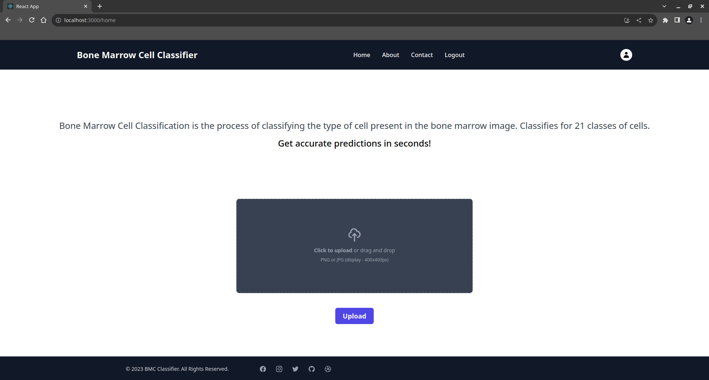
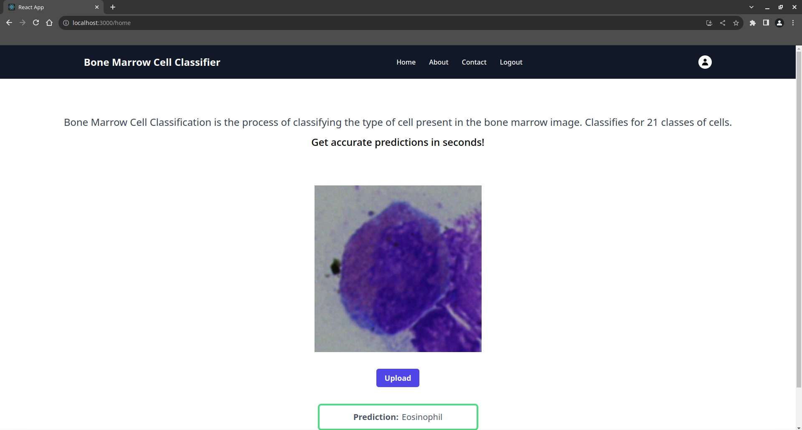

<h1 align="center"> Bone Marrow Cell Classifier</h1>

For proper diagnosis and management of hematologic diseases, bone marrow cells must be properly categorized. We propose an Attention-Guided Residual Networks (AG-ResNet) for classifying multi-class bone marrow cells using ResNet50 and Attention Mechanisms, specifically Channel Attention Module (CAM) and Position Attention Module (PAM). In order to concentrate on informative features, our method takes advantage of the classification problem’s hierarchical structure and incorporates channel and space-wise mechanisms for attention.

## Installation
To install all the required libraries run the following command.

`pip install requirements.txt`

To install tailwind & other packages, run the following command

`npm install`

Add your own API key and config in the firebase.js file.

## Demo

Run both frontend and backend in different terminals.

React frontend command:

`npm start`

fastapi backend command:

`uvicorn main:app --reload`

Home page

 </img>

Classification of bone marrow cells

 </img>
